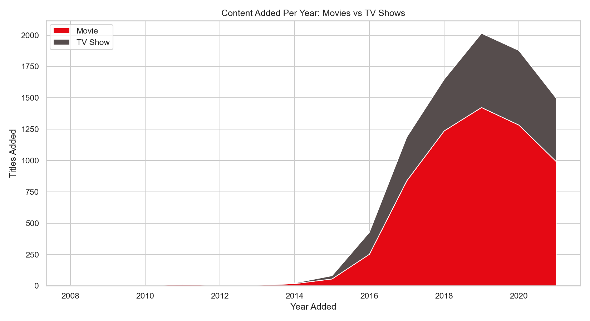
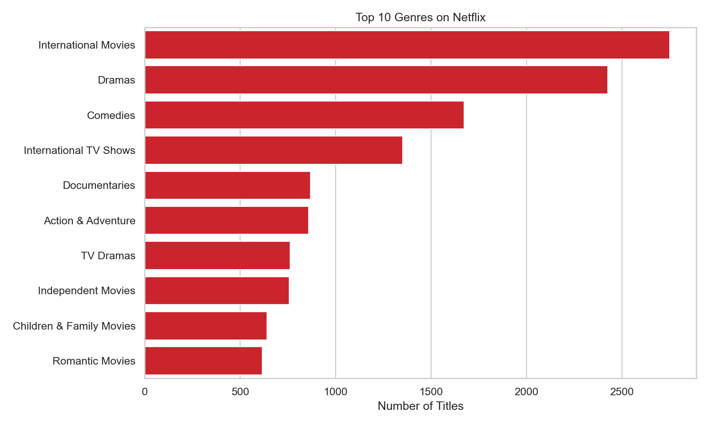
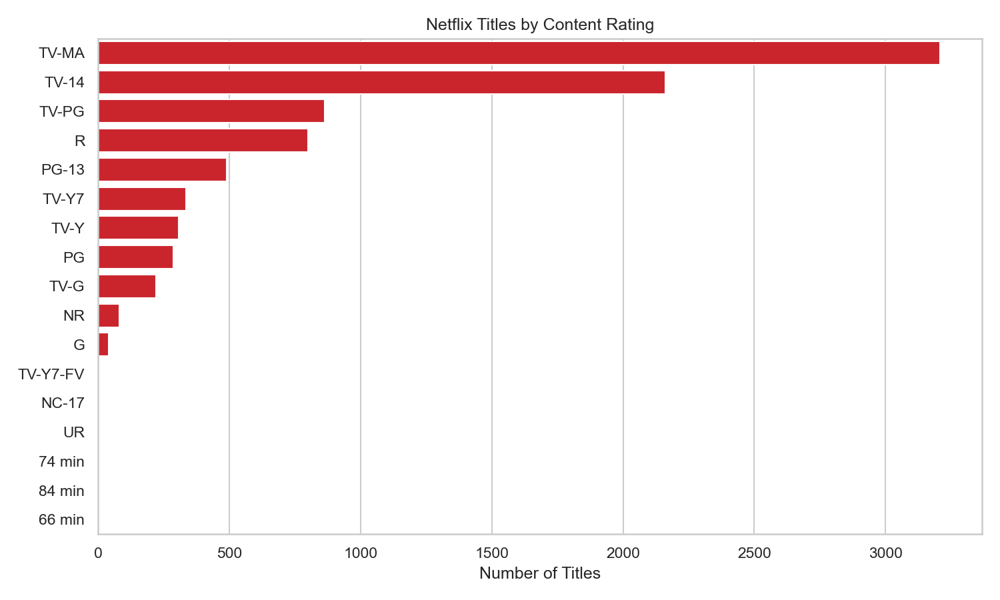
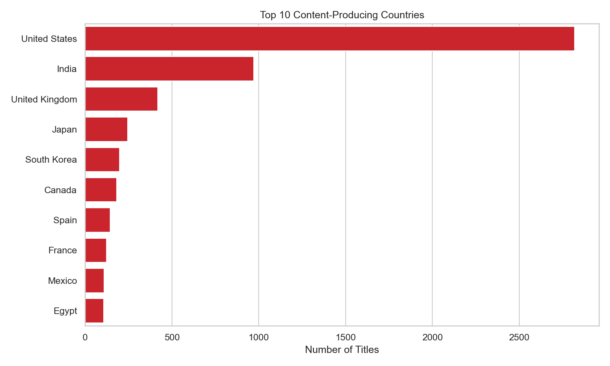

# Netflix Content Analytics

> Analyzing genre trends, ratings, and catalog strategy across Netflix's content library.


---

## Business Problem

How has Netflix's content strategy evolved over time? This project analyzes the
composition of Netflix's catalog — genres, ratings, countries, and the pace of
additions — to infer what the data reveals about the company's content decisions.

## Questions Asked

1. How is the catalog split between Movies and TV Shows, and how has that shifted?
2. Which genres dominate the library?
3. How have genre proportions trended over time?
4. Is the catalog skewing toward more mature ratings?
5. Which countries produce the most Netflix content?
6. How "fresh" is the catalog (release year vs. date added)?

## Tools

- **Python** (pandas, numpy) — data loading and cleaning
- **DuckDB** — SQL analysis directly on DataFrames
- **matplotlib / seaborn** — visualization
- **Jupyter** — analysis environment

## Project Structure

```
netflix-analytics/
├── data/        # raw + cleaned data
├── notebooks/   # the analysis (start here: netflix_analytics_starter.ipynb)
├── sql/         # saved query files
├── visuals/     # exported charts
└── README.md
```

## How to Run

```bash
pip install pandas numpy duckdb matplotlib seaborn jupyter
jupyter notebook notebooks/netflix_analytics_starter.ipynb
```

## Key Findings

Finding 1 — Netflix's content engine switched on in the mid-2010s and peaked in 2019.
Title additions were negligible before ~2014, then accelerated sharply, peaking at 2,016 titles in 2019 with 2020 close behind (1,879). This reflects Netflix's transformation from a licensing-driven catalog into an aggressive content-acquisition platform during the streaming-wars era. (Chart: V4)



Finding 2 — The catalog is movie-heavy by count (70/30), but that understates TV.
Movies make up 69.6% of titles (6,131) versus 30.4% for TV shows (2,676) — roughly a 70/30 split. However, title counts understate TV's strategic weight: one series represents far more watch-time and subscriber retention than one film, so a catalog that looks movie-dominated by count is likely far more balanced by actual engagement. (Chart: V4)

Finding 3 — "International Movies" is the single largest genre, signaling a global-first strategy.
The top genres are International Movies (2,752), Dramas (2,427), and Comedies (1,674). The fact that the #1 category is international — ahead of any domestic genre — points to a deliberate strategy of acquiring globally to serve international subscriber growth, not just a US-centric library. (Chart: V1 / Q2)



Finding 4 — The library skews heavily toward mature content.
TV-MA is by far the most common rating (3,207 titles), followed by TV-14 (2,160), with family ratings like TV-PG (863) trailing well behind. Netflix's catalog is built primarily for adult audiences, consistent with a service competing on prestige and edgy originals rather than family-friendly breadth. (Chart: V3 / Q6)






## Limitations

The public Netflix dataset contains **no true engagement metrics** (view counts,
watch time). "Engagement" in this analysis is inferred from catalog composition and
the pace of content additions, not measured directly. A companion Spotify analysis
(using the `popularity` score) provides a real audience-behavior signal for contrast.

## Data Note

The included `netflix_titles.csv` is a **synthetic sample** generated to mirror the
structure and messiness of the real Kaggle "Netflix Movies and TV Shows" dataset
(nulls, mixed date formats, multi-genre strings, mixed duration units). Swap in the
real Kaggle file to run the same pipeline on actual data.
